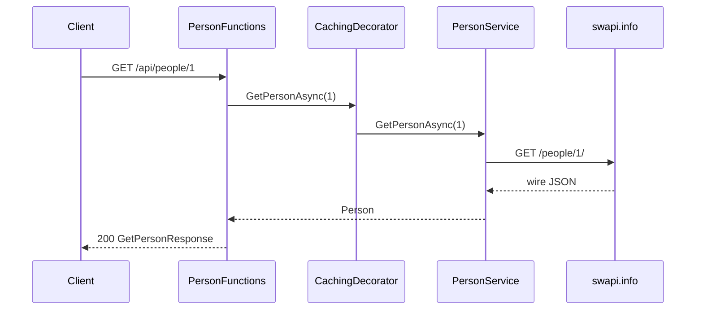

# Example feature — Person query and UpdatePerson processor

The `Example/` slice demonstrates a **query** (synchronous HTTP read) and a **processor** (async message handling) against SWAPI.

## Query flow — GET person

```
Client → PersonFunctions (GET) → PersonMapper (response)
              ↓
     PersonServiceCachingDecorator → PersonService → ISwapiClient → SwapiClient → swapi.info
```

- **Primary local path:** `GET /api/people/1?code={functionKey}`
- **Decorator:** `GetPersonAsync` is cached via `PersonServiceCachingDecorator` (Scrutor `Decorate<IPersonService, …>` in `Program.cs`). Writes and processor paths pass through uncached.
- **Not found:** SWAPI miss → `404`.

## Processor flow — UpdatePerson

**Production entry:** Service Bus trigger on `update-person` queue. Message body:

```json
{ "id": 1 }
```

**Local / component test entry:** `POST /api/people/requested/process/debug` with the same JSON body.

```
Service Bus or debug HTTP → PersonFunctions
    → PersonMapper (DTO → domain)
    → PersonService
    → ISwapiClient → SwapiClient
```

The processor service orchestrates only — no HTTP receiver, no blob backup, no `ReceiverServiceBase` in v1. Add a receiver when you need `POST → blob → queue` (see `dotnet-best-practices` production examples).

## Sequence diagram



## Copying the slice for a new resource

1. Add `VehicleFunctions.cs` in `Example/Functions/` and `VehicleService.cs` in `Example/Services/`, plus models, mappers, and tests.
2. Put all Azure Functions for that resource in one file — not in separate `Queries/` / `Processors/` / `Receivers/` folders or per-function files.
3. Register services in `ServiceCollectionExtensions` and mappers/functions in `Program.cs`.
4. Add component tests under `Features/Example/{Resource}/` and unit tests mirroring `src/`.
5. Extend `ApplicationFactory` routes for new HTTP endpoints.

## Integration tests (v1)

| Tag | Scenario | Notes |
|-----|----------|-------|
| `@smoke` | `GET /api/home` → 200 | ServiceInfo; skipped when `FUNCTIONS_HOST_URL` is unset |
| `@integration` | `GET /api/people/1` on TST | Documented only — enable in pipeline after TST deploy |

Run against TST:

```bash
dotnet test test/Template.IntegrationTests -settings integrationtests.tst.runsettings
```
